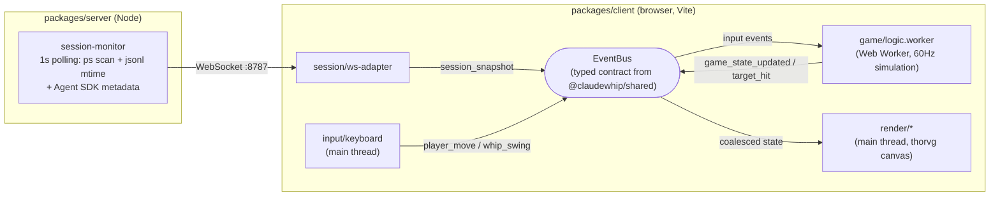

# ClaudeWhip

A browser game for people with too many Claude Code sessions: **every active Claude Code session on your machine spawns a Claude-looking character, lined up on the right side of the screen — and you (also Claude-looking) get a whip.** Hits are purely visual; your real sessions are never touched.

Each target wears its session's shell prompt as a label (`~/…/my-project main ❯ claude █`, with a block cursor while the session is working). Land 3 hits within 1.5 seconds and the target goes groggy.

**▶ Play it now: <https://ossca-thorvg.github.io/Hackathon-ClaudeWhip/>** — works standalone (move & swing with zero targets). To see your own sessions as characters, run the bridge server locally (see below) and press **connect** in the top bar.

## How it works



- A local **bridge server** detects the machine's live Claude Code sessions (process scan + transcript mtime + Agent SDK metadata) and pushes them over WebSocket.
- The **client** renders everything on a single [thorvg](https://github.com/thorvg/thorvg) canvas (one Lottie Scene per character), runs the 60Hz simulation in a Web Worker, and wires components together exclusively through a typed event bus.
- **The server is optional.** The client boots with zero targets and works standalone (move, swing); connecting to a bridge from the top bar is what makes session characters pop in.

Every architectural decision is documented as an ADR — open `docs/adr/index.html` in a browser.

## Getting started

Requirements: Node ≥ 22.18, [pnpm](https://pnpm.io).

```bash
pnpm install
pnpm dev          # bridge server (:8787) + client (:5173)
```

Open <http://localhost:5173>, then press **connect** in the top bar (default address `ws://localhost:8787`). Your running Claude Code sessions appear as characters.

The same works on the [hosted page](https://ossca-thorvg.github.io/Hackathon-ClaudeWhip/) — it is a static build of the client, so start the bridge on your machine (`pnpm dev:server`) and connect to `ws://localhost:8787` from there.

| Key | Action |
|---|---|
| Arrow keys | Move |
| Space | Swing the whip |

## Commands

```bash
pnpm dev          # server + client together
pnpm dev:client   # client only (no session characters, still playable)
pnpm typecheck    # typecheck all workspaces (+ e2e)
pnpm test         # unit tests (Vitest)
pnpm test:e2e     # end-to-end tests (Playwright, uses a fake bridge — no real sessions needed)
```

## Project structure

```
packages/
  shared/   Typed event contract shared by server and client
  server/   Bridge server: session detection → WebSocket push
  client/   Vite app: event bus, worker simulation, thorvg rendering, input
e2e/        Playwright tests driven by a fake bridge WS server
docs/adr/   Architectural Decision Records (start at index.html)
```

Hit detection, animation timing, and hitboxes are all derived from measured asset geometry in `packages/client/src/assets/manifest.ts` — the tests derive their expectations from the same source, so swapping assets keeps everything in sync.
